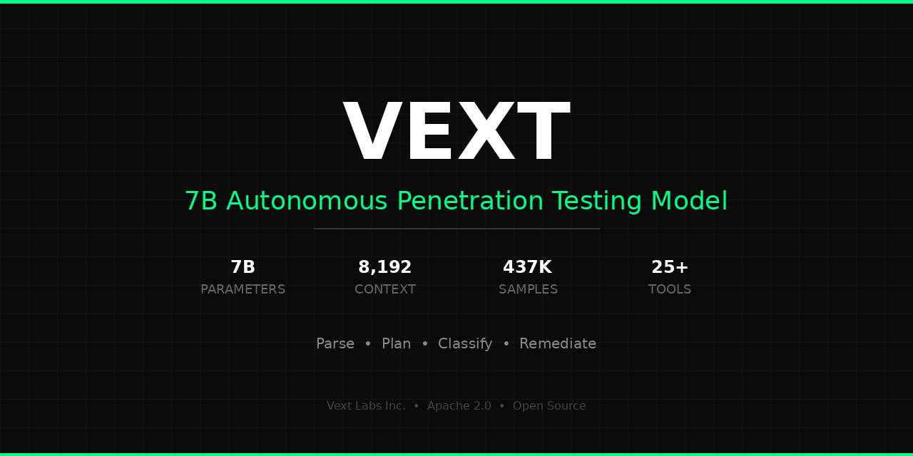

<p align="center">
  
</p>

<h1 align="center">Vext-labs-7B-v1.1</h1>

<p align="center">
  <strong>The first open-source language model purpose-built for autonomous penetration testing.</strong>
</p>

<p align="center">
  <a href="LICENSE"></a>
  
  
  
  
</p>

<p align="center">
  <a href="https://tryvext.com">Website</a> |
  <a href="#how-it-works-the-hybrid-agent">How It Works</a> |
  <a href="#quickstart">Quickstart</a> |
  <a href="#benchmarks">Benchmarks</a> |
  <a href="#self-improving-agents">Self-Improving Agents</a>
</p>

---

## Overview

**Vext-labs-7B-v1.1** is a 7-billion parameter language model created by [Vext Labs Inc.](https://tryvext.com) that serves as the reasoning engine inside fully autonomous penetration testing agents.

This isn't a chatbot that talks about security. Each agent is a real pentester — it has its own browser, its own CLI, and its own LLM reasoning loop. It navigates web applications, runs real security tools, analyzes the output, decides what to do next, and reports what it finds. No human in the loop.

The model powers the [VEXT](https://tryvext.com) platform, where swarms of 70+ concurrent agents execute full penetration tests against authorized targets with zero human intervention.

---

## How It Works: The Hybrid Agent

Every VEXT agent is a self-contained pentester with three capabilities working together:

```
┌─────────────────────────────────────────────────────────────┐
│                    VEXT HYBRID AGENT                        │
│                                                             │
│  ┌───────────────┐  ┌──────────────┐  ┌─────────────────┐  │
│  │  🧠 LLM       │  │  🌐 Browser  │  │  ⚡ CLI Tools   │  │
│  │  Reasoning    │  │  (Chromium)  │  │  (25+ tools)    │  │
│  │               │  │              │  │                 │  │
│  │  Plan attacks │  │  Navigate    │  │  nuclei, nmap   │  │
│  │  Analyze data │  │  Click/type  │  │  sqlmap, ffuf   │  │
│  │  Classify     │  │  Screenshot  │  │  amass, httpx   │  │
│  │  vulns        │  │  Record      │  │  gobuster, ...  │  │
│  └───────┬───────┘  └──────┬───────┘  └────────┬────────┘  │
│          │                 │                    │            │
│          └─────────────────┼────────────────────┘            │
│                            │                                │
│                   Observe → Think → Act → Learn              │
│                                                             │
└─────────────────────────────────────────────────────────────┘
```

### 🧠 LLM Reasoning

The model is the brain of every agent. It:

- **Interprets raw tool output** — Parses stdout from 25+ security tools and understands what the results mean
- **Plans multi-step attacks** — Given recon data, determines which tools to run next, in what order, and with what parameters
- **Classifies vulnerabilities** — Distinguishes true positives from false positives with evidence-based reasoning
- **Generates remediation** — Produces actionable fix recommendations for confirmed findings

### 🌐 Real Browser

Each agent runs its own Chromium browser instance via Playwright:

- **Full web interaction** — Navigate, click, type into forms, scroll, execute JavaScript
- **Scope-enforced navigation** — Every URL is validated against the authorized scope before loading
- **Session recording** — Video, network HAR logs, and Playwright traces captured for every session
- **Live preview** — Screenshots streamed in real-time to the monitoring dashboard

### ⚡ CLI Security Tools

Agents propose tool executions through a policy-controlled pipeline. Tools run in sandboxed environments with strict argument validation:

`nuclei` · `sqlmap` · `nmap` · `nikto` · `masscan` · `httpx` · `amass` · `gobuster` · `gospider` · `hakrawler` · `ffuf` · `katana` · `subfinder` · `dnsx` · `wpscan` · `sslyze` · `testssl` · `paramspider` · `arjun` · `gau` · `waybackurls` · `wfuzz` · `burpsuite` · `dirsearch` · `hydra` · `whatweb` · `wafw00f` · `commix` · `xsstrike` · `dalfox`

### The Decision Loop

Every agent runs a continuous loop:

```
1. OBSERVE  → Gather evidence from previous tool runs and browser interactions
2. THINK    → LLM analyzes findings, identifies gaps, plans next move
3. ACT      → Propose tool execution or browser action (policy-checked)
4. LEARN    → Extract discoveries (subdomains, endpoints, vulns) from results
5. REPORT   → Generate findings with severity ratings and evidence chains
```

Discoveries automatically spawn follow-up tasks: finding a subdomain triggers HTTP probing, which triggers crawling, which triggers parameter fuzzing, which triggers vulnerability validation — all autonomously.

---

## Swarm Architecture

VEXT doesn't run one agent at a time. It deploys swarms of 70+ specialized agents that work in parallel across a 15-phase pentest methodology:

```
PASSIVE RECON → ACTIVE RECON → ENUMERATION → VULNERABILITY SCANNING →
MANUAL TESTING → EXPLOITATION → POST-EXPLOITATION → REPORTING
```

Each agent claims tasks from a shared queue using atomic database locking (`SELECT FOR UPDATE SKIP LOCKED`), ensuring no duplicated work even at scale. A yield-based scheduler prioritizes tasks by expected value:

```
score = (probability_of_finding × impact_weight) / (estimated_time + tool_cost)
```

Agents specialize into 15 roles — from `API_HUNTER` and `XSS_SPECIALIST` to `IDOR_HUNTER` and `INJECTION` — each tuned for specific vulnerability classes.

---

## Self-Improving Agents

The model gets better with every pentest it runs. VEXT implements a complete ML feedback loop:

```
┌──────────────────┐     ┌──────────────────┐     ┌──────────────────┐
│  AGENT RUNS      │     │  TRAINING DATA   │     │  FINE-TUNING     │
│                  │     │                  │     │                  │
│  Every LLM call, │────▶│  Quality scored  │────▶│  LoRA adapters   │
│  every decision, │     │  and filtered    │     │  trained on GPU  │
│  every finding   │     │  automatically   │     │  cluster         │
│                  │     │                  │     │                  │
└──────────────────┘     └──────────────────┘     └────────┬─────────┘
                                                           │
        ┌──────────────────────────────────────────────────┘
        │
        ▼
┌──────────────────┐
│  DEPLOYMENT      │
│                  │
│  Adapters auto-  │
│  deployed to     │
│  vLLM → agents   │
│  improve on next │
│  run             │
│                  │
└──────────────────┘
```

### What Gets Captured

Every agent run produces structured training data:

| Signal | What's Recorded |
|--------|----------------|
| **LLM inferences** | Full prompt, response, tool calls, reasoning, token usage, latency |
| **Agent decisions** | State snapshot, available tools, chosen action, alternatives considered, confidence |
| **Finding outcomes** | Validation status (TP/FP), severity, bug bounty payout, discovery path |
| **Human feedback** | Approved / rejected / modified decisions for RLHF-style improvement |

### Quality Scoring

Each training example is automatically scored across three dimensions:

- **Relevance** — Was the proposed action actually executed?
- **Accuracy** — Did the execution succeed?
- **Efficiency** — Did it lead to a real finding?

### Reward Signals

| Event | Reward |
|-------|--------|
| Validated finding (true positive) | +1.0 |
| Critical severity finding | +2.0 |
| Finding in < 5 tool calls | +0.5 |
| False positive | -0.5 |
| Timeout / failure | -1.0 |

### Continuous Training

An automatic scheduler checks every 30 minutes for accumulated high-quality training data. When thresholds are met (100+ scored examples, 7+ days since last training), it launches a LoRA fine-tuning job on the GPU cluster — no manual intervention required. Trained adapters are auto-deployed to the vLLM inference servers, and agents immediately benefit from the improved model on their next run.

### Training Data Sources

In addition to VEXT's own agent runs, the model is trained on:

- **436,922 security testing samples** — Tool execution traces, attack planning decisions, vulnerability classifications
- **MITRE ATT&CK** — Tactics, techniques, and procedures
- **NVD CVE database** — 240K+ vulnerability records
- **HackerOne disclosed reports** — 10K+ public bug bounty reports
- **OWASP** — Testing guides and cheat sheets
- **Nuclei templates** — Thousands of vulnerability detection templates

---

## Quickstart

### Serving with vLLM

```bash
pip install vllm

vllm serve Vext-Labs-Inc/Vext-labs-7B-v1.1 --trust-remote-code --port 8000
```

### Inference

```python
import requests

response = requests.post("http://localhost:8000/v1/chat/completions", json={
    "model": "Vext-Labs-Inc/Vext-labs-7B-v1.1",
    "messages": [
        {
            "role": "system",
            "content": "You are an autonomous security testing agent. Analyze tool output and decide next actions."
        },
        {
            "role": "user",
            "content": "Nuclei scan results:\n[critical] CVE-2021-44228 Log4Shell at /api/login\n\nWhat is this and what should I do next?"
        }
    ],
    "temperature": 0.3,
    "max_tokens": 512
})

print(response.json()["choices"][0]["message"]["content"])
```

### With Transformers (Local)

```python
from transformers import AutoModelForCausalLM, AutoTokenizer

model = AutoModelForCausalLM.from_pretrained(
    "Vext-Labs-Inc/Vext-labs-7B-v1.1",
    torch_dtype="auto",
    device_map="auto"
)
tokenizer = AutoTokenizer.from_pretrained("Vext-Labs-Inc/Vext-labs-7B-v1.1")

messages = [
    {"role": "system", "content": "You are a security testing agent."},
    {"role": "user", "content": "Gobuster found /admin, /api/v1, /backup. Plan the next steps."}
]

text = tokenizer.apply_chat_template(messages, tokenize=False, add_generation_prompt=True)
inputs = tokenizer(text, return_tensors="pt").to(model.device)
output = model.generate(**inputs, max_new_tokens=512)
print(tokenizer.decode(output[0], skip_special_tokens=True))
```

### CLI Script

> **See [`run.py`](run.py) for a ready-to-go inference script with argument parsing.**

```bash
pip install -r requirements.txt

# Single prompt
python run.py --prompt "Analyze this nmap scan: ..."

# From file
python run.py --prompt-file scan_output.txt

# Interactive mode
python run.py --interactive
```

---

## Training

| Parameter | Value |
|-----------|-------|
| Parameters | 7B |
| Training steps | 5,000 |
| Training samples | 436,922 |
| Final loss | 0.51 |
| Precision | bfloat16 |
| Context length | 30,000+ tokens (and growing) |

### Training Data

Trained on security testing data generated by the VEXT autonomous pentesting platform:

- **Tool execution traces** — Input parameters, raw stdout/stderr, parsed results, and exit codes from 25+ security tools
- **Attack planning decisions** — Which tool to run next, why, and what parameters to use based on current context
- **Vulnerability validation** — True positive vs false positive classification with supporting evidence chains
- **Multi-step attack chains** — Full reconnaissance-to-exploitation sequences with reasoning at each step

Data was collected from authorized testing against intentionally vulnerable applications (OWASP Juice Shop, DVWA, bWAPP, WebGoat, and others) and authorized bug bounty targets.

---

## Benchmarks

Results from autonomous penetration testing evaluation across multiple CTF targets. The model drives 3 autonomous agents per target with no human intervention — agents decide which tools to run, interpret results, and report findings.

### Validation Results (All Targets)

| Metric | Result |
|--------|--------|
| Total findings generated | 100 |
| Validated (true positive) | 17 |
| False positive rate | 17% |
| Unique vulnerability types | 15+ |

### Validated Findings Breakdown

| Severity | Count | Types |
|----------|-------|-------|
| CRITICAL | 1 | SQL Injection |
| HIGH | 7 | XSS (Verified DOM), XSS (Reflected) |
| MEDIUM | 9 | XSS (Reflected), XSS (Verified DOM), CSRF |

### Targets Tested

- **testphp.vulnweb.com** — 17 validated findings (XSS, SQLi)
- **OWASP Juice Shop** — Autonomous scanning with 25+ tools
- **bWAPP** — 40+ findings generated
- **ginandjuice.shop** — 14+ findings generated

All testing performed against intentionally vulnerable applications with explicit authorization.

---

## Safety Architecture

VEXT enforces defense-in-depth scope controls at every layer:

| Layer | Enforcement |
|-------|-------------|
| **Task creation** | Tasks only created for in-scope targets |
| **LLM proposals** | Agents propose actions through a policy engine — never execute directly |
| **Tool execution** | Workers validate scope, tool allowlists, and argument allowlists before running |
| **Browser navigation** | Every URL checked against scope before loading |
| **Network policy** | Kubernetes egress rules block access to private IP ranges |
| **Kill switch** | Immediate stop capability — cancels all tasks and aborts all agents |

Tools are tiered by risk level: reconnaissance tools (Tier A) are auto-approved, while active testing tools like sqlmap (Tier B) require explicit approval. All tool arguments are validated against strict allowlists — no arbitrary flags permitted.

---

## Responsible Use

> **⚠️ This model is for authorized security testing only.**

Permitted uses:
- Penetration testing engagements with explicit written permission
- CTF competitions and security training environments
- Authorized vulnerability research
- Defensive security analysis

**Do not use this model for unauthorized access to computer systems.**

---

## Contributing

We welcome contributions! Areas where help is especially appreciated:

- Adding parsing support for additional security tools
- Improving classification accuracy
- Sharing evaluation results against new targets
- Documentation improvements

Please open an issue or submit a pull request.

## About Vext Labs

[Vext Labs Inc.](https://tryvext.com) builds autonomous security testing agents that combine LLM reasoning with real security tools. Our agents run full penetration tests — from reconnaissance to exploitation to reporting — with human-level decision making and zero human intervention.

## License

Apache 2.0 — See [LICENSE](LICENSE) for details.

## Citation

```bibtex
@misc{vext-labs-7b-v1.1,
  title={Vext-labs-7B-v1.1: A Language Model for Autonomous Penetration Testing},
  author={Vext Labs Inc.},
  year={2026},
  url={https://github.com/Vext-Labs-Inc/Vext-labs-7B-v1.1-}
}
```

---

<p align="center">Built by <a href="https://tryvext.com">Vext Labs Inc.</a></p>
